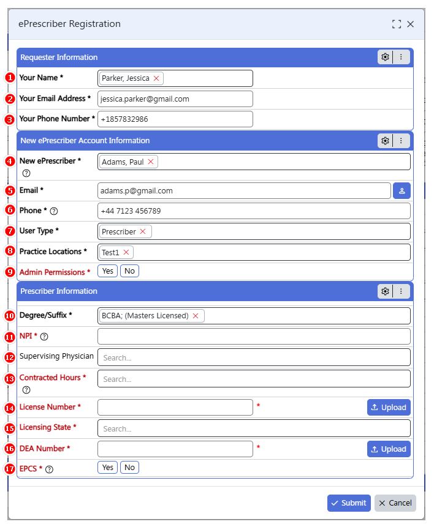

# ePrescriber-Registration
### Overview
The ePrescriber Registration module allows you to add a new prescriber in the system. It helps staff complete ePrescribing setup efficiently.
### Getting Started
Use this module to register a new prescriber in the system. This allows staff to complete ePrescribing setup efficiently.

1. **Your Name:** Search for and select the person requesting registration.  
2. **Your Email Address:** Enter the requester’s email.  
3. **Your Phone Number:** Enter the requester’s phone number.  
4. **Agency Name:** Automatically displays the clinic name.  
5. **New ePrescriber:** Select the prescriber’s name.  
6. **Email & Phone:** Enter prescriber’s contact info.  
7. **User Type:** Select from Prescriber, Clinical Staff, Non-Clinical Staff, or Front Desk.  
8. **Practice Locations:** Select location where prescriber will operate.  
9. **Admin Permissions:** Yes/No for administrative access.  
10. **Degree/Suffix:** Fill accordingly and upload required documents.
11. ### Professional Credentials
11. **NPI:** Enter the prescriber’s *National Provider Identifier (NPI)* — an **11-digit unique identifier** assigned to healthcare providers.  
12. **Supervising Physician:** Select the supervising physician, if applicable.  
13. **Contracted Hours:** Select the contracted hours for the prescriber.  
14. **License Number:** Enter the prescriber’s *state medical license number.*  
    - Use the **Upload** button to attach scanned copies of the license document.  
15. **Licensing State:** Select the state where the license was issued.  
16. **DEA Number:** Enter the prescriber’s *DEA Registration Number.*  
    - Use the **Upload** button to attach the prescriber’s DEA document.  
17. **EPCS (Electronic Prescribing of Controlled Substances):**  
    Select **Yes** if the staff member will be prescribing controlled substances, or **No** if they will not.

 ### FAQs
[Q] How do I set up the staff so they are able to prescribe Controlled Substances?  
[A] Select “Yes” for EPCS on the ePrescribing Registration form if the staff member will be prescribing Controlled Substances.  

[Q] How do I upload license documents?  
[A] Use the Upload button next to the License Number field to upload scanned copies of the prescriber’s medical license.  

[Q] What if the new prescriber’s name doesn’t appear in the list?  
[A] Make sure the prescriber’s Staff Info record is created. If not, first create their Staff Info record and then return to the ePrescribing Registration form.  
